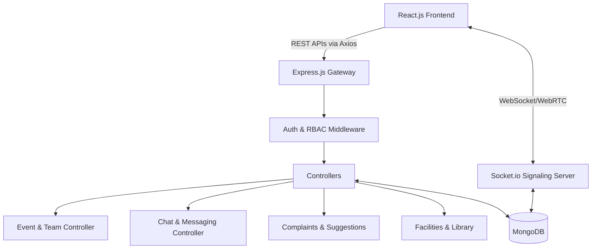

# PCCOER CampusCare: Project Overview & Startup Strategy

## 1. Overall Description
**PCCOER CampusCare** is a unified, SaaS-grade "Smart Student Support & Campus Management" platform. It serves as the digital backbone for educational institutions, centralizing communication, event management, and administrative workflows into a single ecosystem.

### **Tech Stack**
*   **Frontend**: React.js (Vite), Tailwind CSS (for modern, responsive UI), Framer Motion (for micro-animations), React Router, Zod (Validation), Axios.
*   **Backend**: Node.js, Express.js RESTful APIs.
*   **Database**: MongoDB (Mongoose ODMs).
*   **Real-time Infrastructure**: Socket.io (WebSockets) for real-time messaging, WebRTC for peer-to-peer Audio/Video conferencing.
*   **Authentication**: JSON Web Tokens (JWT) with Role-Based Access Control (RBAC).

---

## 2. Problem Statement
Universities and colleges suffer from **fragmented digital ecosystems**. Students are forced to navigate a disjointed maze of disjointed platforms: one system for academics, another for filing grievances, a WhatsApp group for event registrations, and external tools for alumni networking. 

This fragmentation leads to:
*   Slow grievance resolution times.
*   Poor student engagement and low event turnout.
*   A disconnect between alumni and current students.
*   Inefficient resource and facility booking for faculty.

---

## 3. The Solution
PCCOER CampusCare solves this by providing an **all-in-one ecosystem**. It acts as a digital campus square that addresses the problem through specific modules:
*   **Centralized Helpdesk**: A transparent complaint and suggestion management system where students can track the status of their requests in real-time.
*   **Hackathon & Event Engine**: A fully automated workflow for creating events, managing team formations, handling project submissions, and tracking attendance.
*   **Unified Communications**: Built-in Slack-like text channels (Department Hubs) and Zoom-like WebRTC video/audio calling.
*   **Alumni & Mentorship Hub**: A dedicated space for students to request mentorship and read placement experiences from verified alumni.
*   **Campus Logistics**: Facility booking and library book reservations.

---

## 4. Technical Architecture
The system operates on a **Monolithic Client-Server Architecture** designed for high modularity, allowing easy transition to microservices in the future.

---

## 5. What's Missing & What Needs to be Added
To elevate the platform from a college project to a production-ready system:
*   **Automated Certificate Generation**: Integrating `PDFKit` or `Puppeteer` to automatically generate and email certificates upon hackathon completion.
*   **Payment Gateway**: Integration with Stripe or Razorpay for paid event registrations, cafeteria orders, or transcript requests.
*   **Push Notifications**: Implementing Firebase Cloud Messaging (FCM) or Service Workers for offline and mobile push notifications.
*   **File Upload Infrastructure**: Migration to AWS S3 or Cloudinary for secure handling of student project submissions, hackathon demo videos, and profile avatars.
*   **Mobile Application**: Developing a React Native application to ensure students have on-the-go access.

---

## 6. Startup Viability & Strategy
To pivot this project into a scalable B2B SaaS startup:
1.  **White-Labeling**: Restructure the frontend architecture to support dynamic theming. Allow other colleges to buy the software and instantly apply their own logos, colors, and branding.
2.  **Freemium SaaS Model**: Offer the base Complaint Management and Chat modules for free to Tier-2/Tier-3 colleges, but charge an annual subscription for advanced features like Hackathon Management, Alumni Networking, and WebRTC Video Calls.
3.  **Data Analytics Dashboard**: Provide university admins with predictive analytics (e.g., "Which department has the highest grievance rate?" or "What is the correlation between hackathon participation and placement rates?").

---

## 7. Patentable & Unique Differentiators (The "Moat")
To protect the intellectual property and stand out to investors, you should implement and attempt to patent the following highly unique features:

### A. Algorithmic Student Engagement & Employability Scoring (Gamification)
Instead of just a standard portal, integrate a system that calculates a **Dynamic Employability Score**. 
*   **The Feature**: The system automatically aggregates data across the platform (e.g., hackathons won, library books read, positive peer reactions in chat, mentorship sessions attended). It converts this into a verified "Campus XP" and Leveling system. 
*   **Why it's unique**: This score acts as a digital portfolio that the university can export directly to recruiting companies, providing a holistic view of a student beyond just their GPA.

### B. AI-Driven Grievance Routing & Sentiment Analysis
*   **The Feature**: When a student submits a complaint, an NLP (Natural Language Processing) AI model analyzes the text to determine the severity, sentiment, and the exact department it should be routed to, bypassing bureaucratic bottlenecks. 
*   **Why it's unique**: You can patent the specific algorithmic workflow of prioritizing student distress signals and automatically alerting psychological counselors or specific admins based on keyword triggers.

### C. Blockchain-Verified Alumni Credentials & Certificates
*   **The Feature**: Issue hackathon certificates and alumni verification badges as non-transferable NFTs or cryptographic hashes on a lightweight blockchain (like Polygon).
*   **Why it's unique**: Eliminates resume fraud. When a student applies for a job, recruiters can click a link generated by your platform that cryptographically proves they won the Hackathon or that an Alumni actually works at the claimed company.
